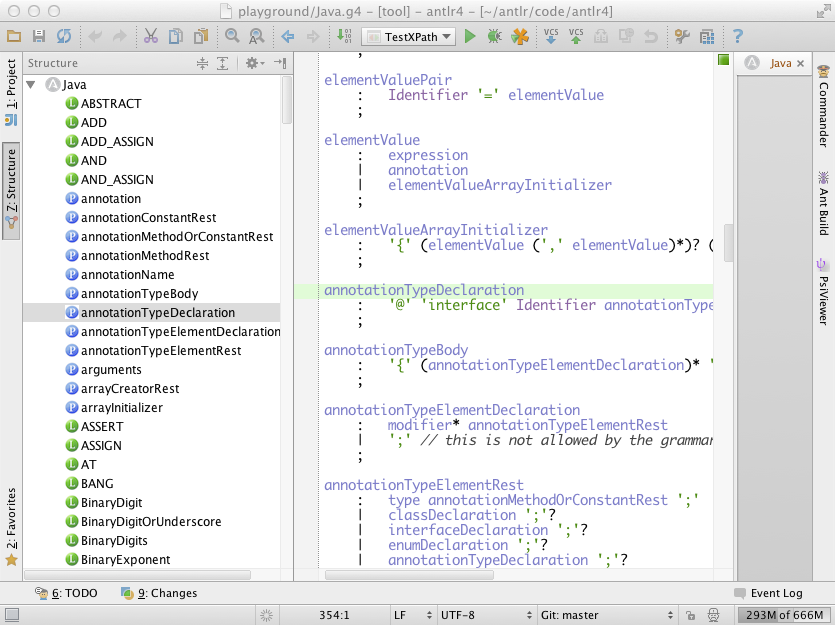
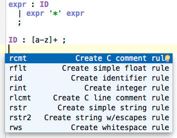
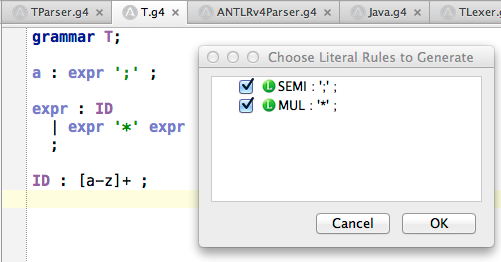
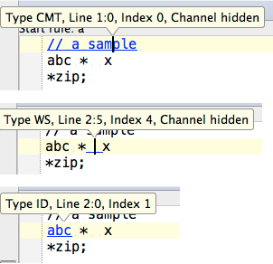
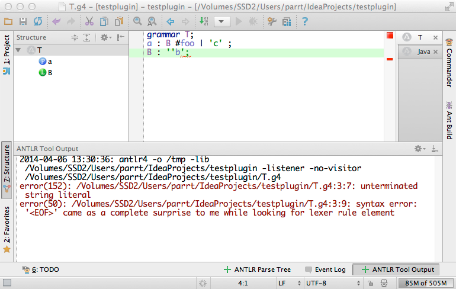
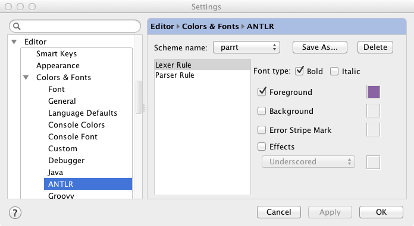

# IntelliJ Idea Plugin for ANTLR v4

An [IntelliJ](https://www.jetbrains.com/idea/) 12.1.x, 13.x plugin for ANTLR v4 ([plugin source at github](https://github.com/antlr/antlr4)).

[Plugin page at intellij](http://plugins.jetbrains.com/plugin/7358?pr=idea)

This plugin is for ANTLR v4 grammars. Features: syntax highlighting,
syntax error checking, semantic error checking, navigation window,
goto-declaration, find usages, rename tokens, rename rules.
Generates code; shortcut (ctrl-shift-G / meta-shift-G) but it's in Tools menu
and popups.
Code completion for tokens, rule names. finds tokenVocab option for code gen
if there is a tokenVocab option, don't warn about implicit tokens.
shortcut conflicted with grammar-kit plugin. Has live grammar interpreter
for grammar preview. Right click on rule and say "Test ANTLR Rule".
Changes to grammar seen in parse tree upon save of grammar. Works with
Intellij 13.x and requires 12.1.x.

You can configure the ANTLR tool options per grammar file; right-click
in a grammar or on a grammar element within the structured view.
When you change and save a grammar, it automatically builds with ANTLR
in the background according to the preferences you have set.  ANTLR
tool errors appear in a console you can opened by clicking on a button
in the bottom tab.

You can use the meta-key while moving the mouse and it will show you
token information in the preview editor box via tooltips.

Errors within the preview editor are now highlighted with tooltips
and underlining just like a regular editor window. The difference
is that this window's grammar is specified in your grammar file.

meta-j pops up a list of live templates, just like it does for Java programming.
Currently, there are a number of lexical rules for common tokens such as comments
and identifiers that you can automatically inject.
There are shortcuts like rid that lets you jump directly to the
lexical rule you would like to generate. If you type the shortcut and wait a
second, intellij should pop up an action you can select for that shortcut.

ctrl-return, or whatever you have configured for the generate pop-up,
will bring up a list of things you can generate. The only one so far is
a generator to create lexical rules for any literals, referenced in the parser
 grammar, that have not been defined.

## History

See [Releases](PerGramma://github.com/antlr/intellij-plugin-v4/releases)

## Screenshots

### Java grammar view

### Find usages

### Code completion

### Live templates

You can inject predefined lexer rules. Use meta-j or type the abbreviation like rid and wait a second. It should pop up that choice.

### Refactoring: generate rules for literals

It guesses rule names or just uses T__&lt;n>. Respects literals already defined.

### Live parse tree preview

You can test any rule in the (parser) grammar.  Right click on rule in grammar
or navigator to "Test ANTLR Rule".  Changing grammar and saving, updates
parse tree. It works with combined grammars and separated but separated
must be in same directory and named XParser.g4 and XLexer.g4.
No raw Java actions are executed obviously during interpretation in
live preview.

You can also use the meta key while moving the mouse in preview window to get token info.

When there are errors, you will see the output in the small console under the input editor in case you need to cut and paste. But, for general viewing you can however the cursor over an underlined error and it will show you the message in a pop-up. Basically the input window behaves like a regular editor window except that it is subject to the grammar in your other editor.

### Per file ANTLR configuration

### ANTLR output console

### Color preferences

