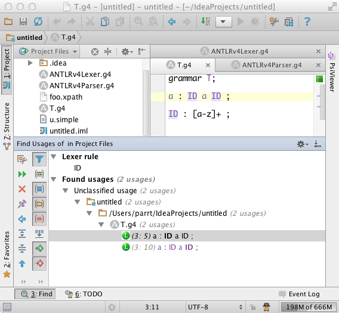
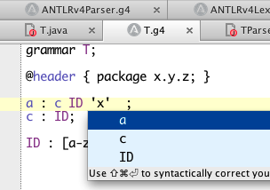
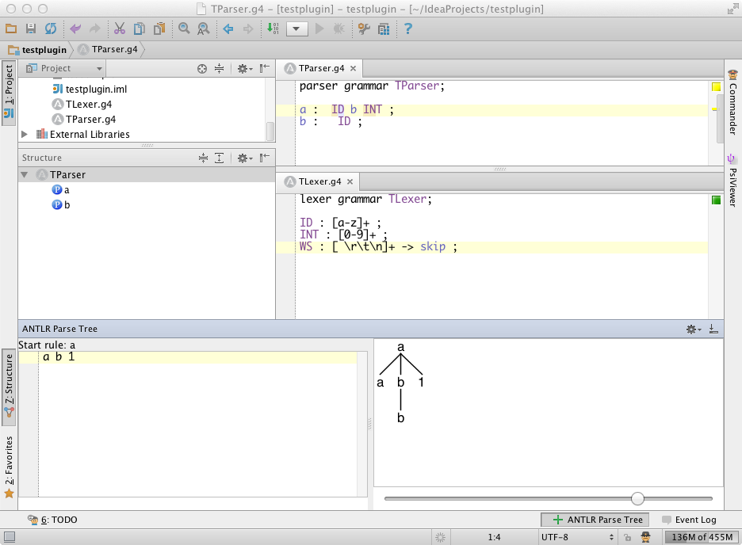
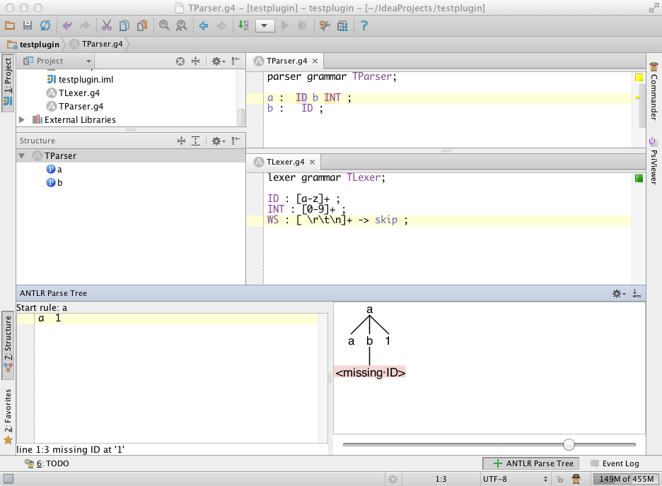
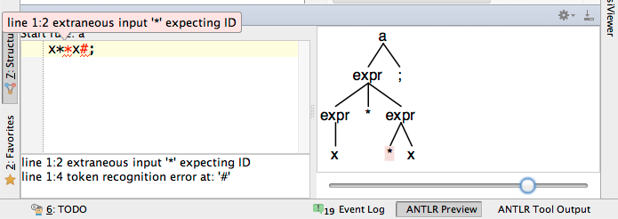
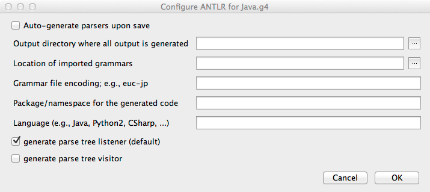

# IntelliJ Idea Plugin for ANTLR v4

An [IntelliJ](https://www.jetbrains.com/idea/) 12.1.x, 13.x plugin for ANTLR v4 ([plugin source at github](https://github.com/antlr/antlr4)).

[Plugin page at intellij](http://plugins.jetbrains.com/plugin/7358?pr=idea)

## History

See [Releases](PerGramma://github.com/antlr/intellij-plugin-v4/releases)

## Screenshots

### Java grammar view

### Find usages

### Code completion

### Live parse tree preview

You can test any rule in the (parser) grammar.  Right click on rule in grammar
or navigator to "Test ANTLR Rule".  Changing grammar and saving, updates
parse tree. It works with combined grammars and separated but separated
must be in same directory and named XParser.g4 and XLexer.g4.
No raw Java actions are executed obviously during interpretation in
live preview.

You can also use the meta key while moving the mouse in preview window to get token info.

When there are errors, you will see the output in the small console under the input editor in case you need to cut and paste. But, for general viewing you can however the cursor over an underlined error and it will show you the message in a pop-up. Basically the input window behaves like a regular editor window except that it is subject to the grammar in your other editor.

### Per file ANTLR configuration

### ANTLR output console

### Color preferences

